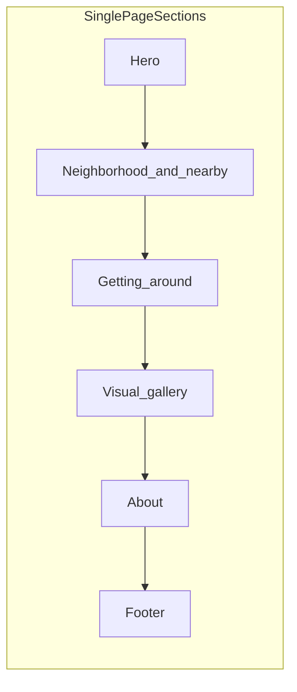

# Cascade Crest LLC — Minimal Rental Business Site

## Overview

Scaffold a minimal, image-forward React site for Cascade Crest LLC on Vercel (Next.js), themed around University Park, The Bluff, and St. Johns—UP-inspired purple palette, rich neighborhood + **transportation** copy, **no street address, forms, or contact**.

---

## Context and defaults

The repo is essentially empty ([README.md](README.md) only names **Cascade Crest LLC**). Unless you reply with different choices, we will assume:

| Topic | Default |
|-------|---------|
| Display name | **Cascade Crest LLC** in footer; **Cascade Crest** in hero |
| Imagery | Curated **Unsplash** (license-safe) photos—**not** official UP logos or trademarked marks |
| About copy | WA-based small rental business; Oregon property near UP / The Bluff; small investor group |
| Neighborhood wording | **University Park**, **The Bluff**, **St. Johns** |

### Location context (for copy only — never on the public site)

- Property on **North Yale Street**, University Park, **~two blocks from the University of Portland campus**.
- **Do not publish** 5892 N Yale St (or any street number/name) on the site, metadata, alt text, or maps.
- Public messaging: *steps from campus*, *on the bluff*, *heart of University Park*—proximity only.

---

## Recommended stack (React + Vercel)

**Next.js (App Router) + TypeScript + Tailwind CSS** on Vercel.



**Layout:** `app/`, `components/` (`Hero`, `Neighborhood`, `NearbyPlaces`, `Transportation`, `ImageGallery`, `About`, `SiteFooter`), `lib/content.ts`.

---

## Visual and UX direction

**Tone:** Mostly photography; neighborhood and transit as **short headlines + one line** each.

**Colors:** UP-adjacent purple `#1E1656`, teal `#0D776E`, mist `#EBE9FF`, warm white `#FAFAF8`.

**Typography:** Serif hero (Fraunces) + sans body (DM Sans) via `next/font/google`.

### Page sections (top → bottom)

1. **Hero** — Bluff/river/bridge image; *Cascade Crest*; *Washington-based rental stewardship · Oregon homes*; subline: *University Park · The Bluff · Steps from campus*.

2. **Neighborhood & nearby** — No address. Opening: *Live where the bluff meets the river—University Park, steps from the University of Portland.*
   - **Place cards** (~8–12 words each): UP campus & bluff walks; Waud Bluff Trail; Willamette / greenway; St. Johns Village; Cathedral Park; Lombard errands & eats; McKenna & Portsmouth parks.
   - Asymmetric image + text or horizontal card strip.

3. **Getting around** (new — transportation)
   - Section headline: e.g. *Easy to leave the car behind* or *Connected by bus and bike*
   - One-sentence intro: North Portland’s University Park is well served by **TriMet** and **bike infrastructure**—stops within easy walking distance; strong bike culture on the bluff and riverfront.
   - **Three pillars** (icon + headline + ~12–20 words), factual and generic (no stop IDs or exact addresses):

     | Pillar | Copy direction |
     |--------|----------------|
     | **TriMet buses** | **Line 35** (Macadam/Greeley) serves the University of Portland area; **Line 44** (Capitol Hwy/Mocks Crest) runs **N Willamette Blvd** and **N Lombard** with campus-adjacent stops. Mention **bus stops a short walk away** on Lombard / Willamette / Greeley corridors—not specific stop numbers. |
     | **Bike-friendly** | Area rates **very bikeable**; neighborhood **greenways** (e.g. Portsmouth–University Park greenway on local streets); **N Willamette Blvd** active transportation corridor (protected bikeway investment); bluff and **North Portland Greenway** connections toward the river and St. Johns. |
     | **Walk & connect** | Daily errands on Lombard; campus on foot; St. Johns and Cathedral Park by bike or bus; longer trips can connect via regional transit (mention **MAX** only as “linking to wider Portland”—optional, light touch). |

   - Visual: one photo (cyclist on Willamette, TriMet bus in North Portland, or greenway)—stock only.
   - **Do not** embed live TriMet maps or stop finders (keeps site static, no maintenance).

4. **Visual gallery** — Portland / Bluff / bridge / skyline; non-identifying streetscapes only.

5. **About** — For-profit WA LLC; small investors; single UP-area rental; stewardship; no address or on-site inquiries.

6. **Footer** — © Cascade Crest LLC; WA · Oregon; not affiliated with UP.

**Motion / a11y:** Scroll fade-in; `prefers-reduced-motion`; alt text; contrast on purple overlays.

---

## Content structure in `lib/content.ts`

```ts
export const proximity = { headline, subhead };

export const nearbyPlaces = [
  { name, blurb, imageKey },
  // UP, Waud Bluff, St. Johns, Cathedral Park, Lombard, parks...
];

export const transportation = {
  headline: "Getting around",
  intro: "...",
  pillars: [
    { name: "TriMet nearby", blurb: "Lines 35 and 44..." },
    { name: "Bike lanes & greenways", blurb: "..." },
    { name: "Walkable bluff living", blurb: "..." },
  ],
};
```

**Review rule:** All strings scanned for address leakage (including Yale St).

---

## Imagery strategy

- Launch: Unsplash/Pexels in `lib/content.ts`; transport image = bus or bike in North Portland (generic).
- Avoid: UP logos, identifiable photos of the property.

---

## About draft

> Cascade Crest is a for-profit Washington State rental company backed by a small group of private investors. We steward a single home in Portland’s University Park neighborhood—on the bluff, steps from the University of Portland, with TriMet stops and bike routes nearby and a short trip to St. Johns, the Willamette, and Cathedral Park. This site captures the spirit of the place, not a listing. We do not publish our property address or accept inquiries here.

---

## Out of scope

- Street address, map pins, forms, contact, tenant applications, live transit widgets

---

## Open items

1. Hero name (Cascade Crest vs LLC)
2. Stock vs your photos
3. Custom domain
4. Emphasize bus vs bike vs equal (default: equal three pillars)

---

## Implementation todos

- [ ] Scaffold Next.js 15 + TypeScript + Tailwind
- [ ] Design tokens + fonts
- [ ] Hero, Neighborhood, **Transportation**, Gallery, About, Footer
- [ ] `lib/content.ts` — nearby + **transport** copy + images (no address)
- [ ] SEO/a11y; build; README + Vercel
